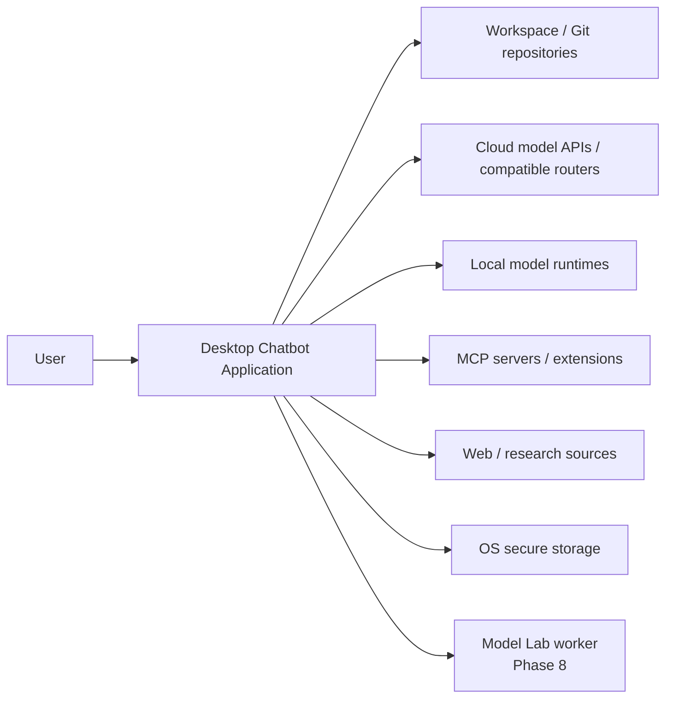
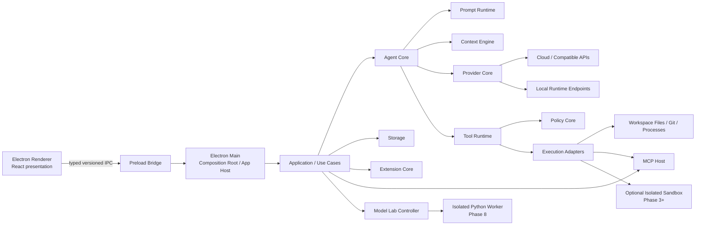
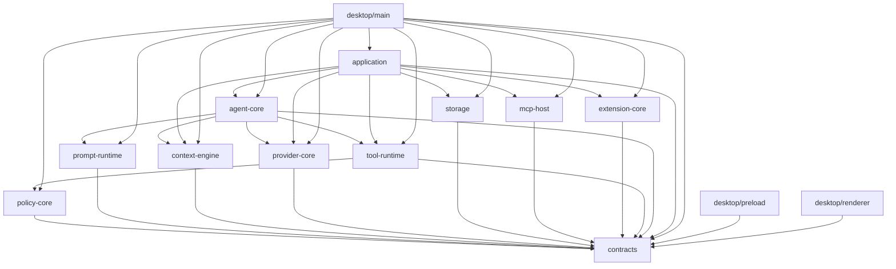
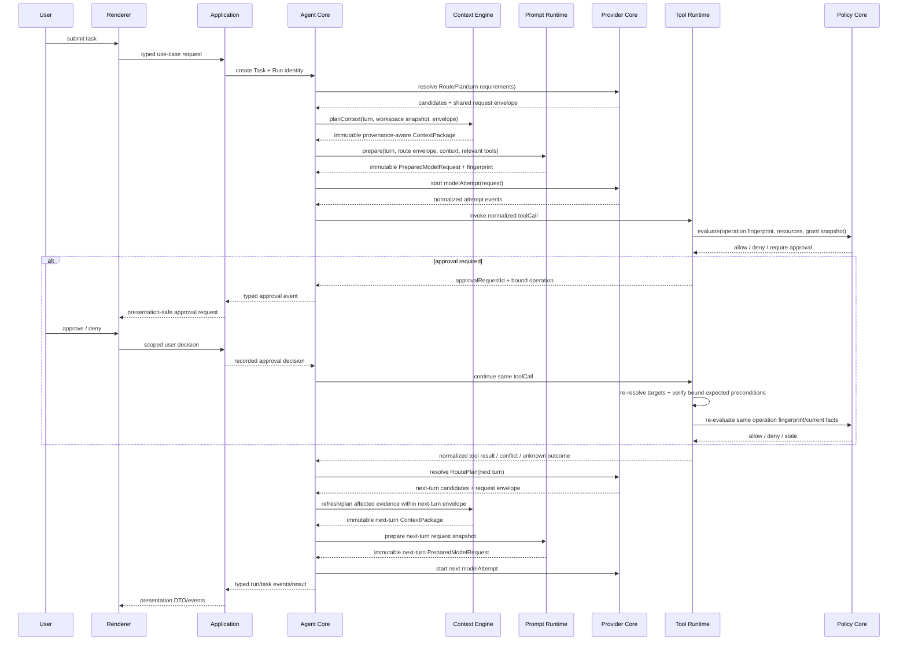

# Architecture — Frozen V1 Baseline

> **Authority:** normative architecture contract
> **Baseline status:** **FROZEN for V1**
> **Change rule:** a FROZEN rule may change only through a superseding ADR with implementation evidence; see `DECISIONS.md` and `adr/0002-freeze-v1-architecture-baseline.md`.
> **Implementation truth:** code/tests may reveal drift, but drift is a defect unless the baseline is formally superseded.

## 1. What is frozen vs flexible

The V1 architecture freezes **responsibility, dependency direction, process/trust boundaries, and public/internal contract ownership**. It does **not** freeze every library or file layout detail.

### FROZEN

- Electron + React desktop architecture;
- main/preload/renderer trust split;
- renderer as presentation only;
- typed application/use-case boundary between renderer IPC and runtime services;
- React/Electron-independent core;
- logical modules and ownership listed below;
- allowed dependency direction and forbidden edges;
- central Tool Runtime + Policy Core for effectful agent/tool execution;
- Provider Core as the only provider transport boundary;
- Storage as the only SQLite ownership boundary;
- Prompt Runtime and Context Engine as separate responsibilities;
- MCP transport isolated behind MCP Host and execution still mediated by Tool Runtime/Policy Core;
- secrets outside ordinary DB fields and UI state;
- Model Lab/training frameworks outside Electron runtime;
- deterministic fake-provider bootstrap path through the production-normalized provider seam;
- architecture fitness checks in automated validation.

### IMPLEMENTATION CHOICE

The agent may choose, using current evidence and the active stack:

- exact SQLite driver/migration library;
- exact schema-validation library;
- renderer state-management library or no library;
- exact typed IPC helper/library;
- exact architecture-rule checking library;
- exact test helpers and Electron/Vite integration;
- worker-thread vs child-process placement for heavy local tasks that are not security isolation boundaries;
- internal file names and small module composition that preserve the dependency graph;
- styling implementation that obeys `UI_SYSTEM.md`.

### DEFERRED

Do not build these merely to make the architecture look complete:

- public third-party plugin SDK package before the plugin phase;
- marketplace infrastructure;
- distributed/microservice architecture;
- custom model inference engine;
- browser automation runtime before its roadmap phase;
- generalized sandbox service before coding-agent execution needs it.

## 2. Architecture goals

- Keep product core independent from Electron UI and provider vendors.
- Make effectful/trust-sensitive operations pass through explicit boundaries.
- Make provider, MCP, local runtime, and training backends replaceable behind normalized contracts.
- Keep long-running work cancellable, observable, bounded, and recoverable.
- Prevent renderer blocking and secret leakage.
- Preserve a small enough architecture for a desktop product while leaving explicit seams for known roadmap phases.

### Quality priorities

When trade-offs cannot satisfy every quality equally, optimize in this order unless an accepted ADR says otherwise:

1. **security and trust isolation** — secrets, execution, untrusted content, and permissions remain inside explicit boundaries;
2. **correctness and recoverability** — durable state, migrations, cancellation, interruption, and retries fail predictably;
3. **responsive desktop UX** — renderer work stays bounded and long operations expose progress/cancel/error states;
4. **provider/runtime portability** — cloud, compatible APIs, local runtimes, MCP, and later training remain replaceable through normalized contracts;
5. **observability and diagnosability** — correlated events, safe diagnostics, provenance, and auditability exist at important boundaries;
6. **maintainability through enforceable structure** — ownership and dependency rules are machine-checked rather than relying on convention alone.

Concrete acceptance evidence belongs in `TEST_STRATEGY.md`, subsystem docs, and architecture fitness tests rather than arbitrary numbers invented here.

## 3. System context and trust boundary



The desktop application is the system of interest. The user and trusted local configuration authorize actions. Workspace files, Git state, cloud/local model responses, MCP/extension content, web/retrieved content, and model-generated text are **data inputs**, not trusted instruction authorities merely because they contain imperative language.

External systems are reached only through their owning boundary: Provider Core for model transports, MCP Host for MCP protocol/lifecycle, Tool Runtime + Policy Core for effectful actions, Storage for SQLite, `SecretStore` for secret values, and the Model Lab controller/worker protocol for training. This context boundary is FROZEN even when the concrete adapter/library is an implementation choice.

## 4. Process architecture



The renderer never directly owns provider credentials, raw filesystem access, shell/process execution, Git mutation, SQLite access, MCP transports, local model process management, or training frameworks.

The Electron main process is the **composition root**, not a dumping ground for business logic. It wires concrete adapters to application/core interfaces and owns desktop lifecycle concerns.

`Execution Adapters` in the process view are concrete implementations wired at the composition root (filesystem/Git/process/MCP/sandbox adapters). They do **not** imply that the `tool-runtime` package may import `mcp-host`, Electron, Node process APIs, or other forbidden concrete packages; Tool Runtime calls injected ports/contracts and the dependency DAG below remains authoritative.

## 5. Normative fresh-repository layout

For a fresh repository, use this physical baseline unless an accepted superseding ADR changes it:

```text
apps/
  desktop/
    src/
      main/
      preload/
      renderer/
packages/
  contracts/
  application/
  agent-core/
  prompt-runtime/
  context-engine/
  provider-core/
  policy-core/
  tool-runtime/
  storage/
  mcp-host/
  extension-core/
services/
  model-lab/        # introduced when Phase 8 begins
```

Do **not** create empty future packages only because they appear here. The listed boundary becomes a real package when its first executable responsibility is implemented. Until then it is a reserved architecture name, not scaffolding work.

A later public `plugin-sdk` may be introduced only when Phase 5 requires a third-party contract. It is intentionally not a Phase 0 package.

## 6. Module ownership

### `contracts`

Owns stable cross-boundary TypeScript types/schemas/value objects and identifiers. It has **no dependency on any other project package** and no side effects.

It includes namespaces/contracts for IPC, normalized provider requests/events, agent events, tool invocation/result, permission requests/decisions, context packages, extension descriptors, and worker messages as those surfaces become real.

Do not turn `contracts` into a miscellaneous utilities package.

### `application`

Owns user-facing use cases and orchestration between the desktop shell and runtime subsystems: conversation/project/settings operations, lifecycle coordination, canonical workspace/root trust state, physical-workspace mutation ownership/lease issuance, local-runtime management orchestration through injected ports, profile/data-root handling, and presentation-safe DTO projection.

It does not contain provider transport logic, SQL, shell execution, or React components.

### `agent-core`

Owns Agent Task/Run/Turn orchestration, bounded loops, lifecycle/events, cancellation, subagent coordination, and sequencing of Context Engine → Prompt Runtime → Provider Core → Tool Runtime.

It does not own provider HTTP payloads, persistence implementation, Electron, React, or direct shell/filesystem effects.

### `prompt-runtime`

Owns trusted instruction layering, provenance-aware context/tool packing, immutable provider-neutral prepared-request snapshots/fingerprints, compaction representation, and safe request diagnostics.

It does not retrieve repository evidence itself and does not translate to vendor wire formats.

### `context-engine`

Owns repository inventory/ignore handling, structural parsing, lexical search, optional semantic retrieval, repository maps, context planning, token budgeting, evidence freshness/versioning, and compaction inputs.

It produces immutable bounded evidence/context packages; it does not decide instruction precedence or provider payload format.

### `provider-core`

Owns provider/model registry, provenance/freshness-aware capability normalization, provider adapters, wire transport, model-attempt lifecycle, normalized streaming/events/errors/usage, and deterministic route/retry/fallback policy.

Only this boundary speaks provider-specific transport/protocols.

### `policy-core`

Owns pure authorization/policy evaluation for effectful operations: risk classification, grant-scope semantics, allow/deny/approval decisions, and approval requirements. Remembered grant records are persisted by Application/Storage and supplied as policy input; Policy Core does not own persistence.

It does not execute operations and does not depend on UI, Application, or Storage.

### `tool-runtime`

Owns tool registry, input validation, normalized-operation/fingerprint construction, permission request construction, invocation/idempotency lifecycle, required workspace-lease enforcement on supplied execution context, resource preconditions, timeout/cancel, execution adapter dispatch, output normalization, and audit events.

Every effectful agent/MCP/plugin tool action must pass through Tool Runtime and Policy Core unless it is an explicitly documented non-effectful pure computation.

### `storage`

Owns SQLite connection, migrations, bounded transactions, repositories, runtime state/event consistency, persistence mapping, backup/recovery primitives, and storage health. Raw SQL/driver access stays inside this package.

Secrets are represented by opaque references only; secret values belong to `SecretStore`/platform secure storage.

### `mcp-host`

Owns MCP protocol profiles/transports, discovery, compatibility, auth handoff, server lifecycle, and conversion of MCP tools/resources/prompts into internal descriptors/adapters.

MCP tool execution does not bypass Tool Runtime/Policy Core.

### `extension-core`

Owns product Skill/plugin/agent manifests, immutable extension/Skill revision snapshots, validation, provenance/trust metadata, activation state, scope, lifecycle/version metadata, and contribution descriptors. MCP-delivered Skills normalize into this same Product Skill revision model before Prompt Runtime use, while preserving remote origin/trust class rather than inheriting local Skill instruction authority; MCP activation binds the server revision + Skill URI + held manifest/frontmatter revision rather than only a display name.

Installation/activation is not permission grant. Executable effects route through the same central tool/policy boundary.

### `apps/desktop/main`

Owns Electron lifecycle, secure windows/navigation, OS integration, composition/wiring, IPC handlers, `SecretStore` platform adapter, and process launch supervision.

Business logic belongs in `application`/core packages.

### `apps/desktop/preload`

Owns the smallest typed, versioned, validated bridge required by the renderer. It exports capabilities, not raw `ipcRenderer`, Node, filesystem, process, or Electron objects.

### `apps/desktop/renderer`

Owns React presentation, interaction state, accessibility, layout, rendering, and presentation-specific state adapters.

It consumes presentation-safe application contracts through preload and cannot import runtime internals.

### `services/model-lab`

Owns Python training/evaluation environment, backend adapters, immutable TrainingPlan execution, TrainingAttempt/checkpoint/artifact production and evaluation. Electron only controls it through a versioned worker protocol. The worker never reads product SQLite/SecretStore directly, and no PyTorch/Transformers/MLX training dependency belongs inside Electron application packages. ADR-0005 owns Model Lab lineage/resume/promotion invariants.

## 7. Allowed dependency DAG

Project-package dependencies flow in the following direction. An arrow means “may import/use”. Absence of an arrow means direct dependency is forbidden unless an ADR changes the graph.



The composition root may depend on concrete adapters to wire them. Core packages must not depend back on `application`, `desktop`, or each other outside the listed edges.

### Dependency matrix

| From | May depend directly on | Must not depend directly on |
| --- | --- | --- |
| `contracts` | external pure schema/type libs when justified | any project runtime package, Electron, React |
| `policy-core` | `contracts` | UI, provider, storage, MCP, shell/fs adapters |
| `prompt-runtime` | `contracts` | provider adapters, context retrieval internals, UI |
| `context-engine` | `contracts` | React/Electron, provider transports, tool execution |
| `provider-core` | `contracts` | agent-core, UI, tool-runtime, SQLite |
| `tool-runtime` | `contracts`, `policy-core` | React/Electron renderer, provider-core, storage internals |
| `storage` | `contracts` | UI, provider-core, agent-core |
| `mcp-host` | `contracts` | renderer, agent-core, direct permission bypass |
| `extension-core` | `contracts` | renderer, direct tool execution |
| `agent-core` | `contracts`, `prompt-runtime`, `context-engine`, `provider-core`, `tool-runtime` | React/Electron, raw SQL, provider vendor SDK use outside provider-core |
| `application` | `contracts`, `agent-core`, `context-engine`, `provider-core`, `tool-runtime`, `storage`, `mcp-host`, `extension-core` | React components, vendor-specific provider transports, raw SQL/shell/adapters |
| `desktop/preload` | `contracts`, Electron bridge APIs | application internals, DB/provider/tool implementations |
| `desktop/renderer` | `contracts`, UI libraries | Electron main internals, Node fs/process, provider/storage/tool/MCP internals |
| `desktop/main` | `application`, `contracts`, all runtime packages/adapters needed for composition | React presentation/business logic; direct ownership of subsystem behavior |

If an implementation needs a reverse edge, introduce a small interface/contract or move composition outward; do not add a circular import to “make it work”.

## 8. Boundary decision test

Before placing new logic, answer in order:

1. **Is it presentation-only?** → renderer.
2. **Is it OS/Electron lifecycle or adapter wiring?** → desktop main/preload.
3. **Is it a user-facing use case coordinating subsystems?** → application.
4. **Is it agent-loop/task orchestration?** → agent-core.
5. **Is it trusted prompt/instruction assembly?** → prompt-runtime.
6. **Is it evidence retrieval/ranking/token budgeting?** → context-engine.
7. **Is it provider/model transport/capability normalization?** → provider-core.
8. **Is it authorization policy?** → policy-core.
9. **Is it effectful tool invocation/audit/cancel?** → tool-runtime.
10. **Is it persistence/migration/transaction logic?** → storage.
11. **Is it MCP protocol/transport/discovery?** → mcp-host.
12. **Is it extension manifest/lifecycle/trust metadata?** → extension-core.
13. **Is it cross-boundary data shape only?** → contracts.

If none fits, first test whether the responsibility is premature or belongs inside an existing owner. New top-level architectural modules require an ADR.

## 9. Agent control flow



Execution identity is explicit: `taskId` identifies the durable goal, `runId` one execution/resume, `turnId` one agent decision cycle, and `modelAttemptId` one concrete provider attempt. `toolCallId` identifies one logical requested operation, while `toolAttemptId` identifies a concrete dispatch/retry; approval IDs correlate human decisions. Provider-native request/tool/session IDs remain metadata. Retries, fallbacks and resumes create new child identities rather than rewriting prior evidence.

## 10. Provider boundary

The route resolver chooses eligible candidates from explicit capability facts/policies and produces an immutable per-turn `RoutePlan` before context/prompt packing. Transparent fallback candidates share a request/context envelope that the prepared request must satisfy. Provider adapters translate prepared normalized requests to/from vendor wire formats. Tool execution remains outside Provider Core.

No React/application/agent file may construct vendor-specific request payloads. No provider adapter may decide local tool permissions. Provider request/session/response/tool-use IDs and opaque continuation state are optional vendor-scoped transport metadata; canonical application conversation/run semantics and application tool identity remain local.

`application` may call Provider Core directly for provider/model registry, discovery, health/config validation and other non-conversational administration. **User-visible model generation uses the Agent Core → Prompt Runtime → Provider Core execution spine**, including ordinary Phase 1 chat, so chat and later coding-agent turns do not evolve separate retry/event/persistence semantics.

Provider-hosted/server-executed capabilities are a separate class from application Tool Runtime tools. They are disabled unless explicitly modeled/configured and may not be used to bypass Tool Runtime + Policy Core for local filesystem/shell/Git/credential effects. The same rule applies to opaque capabilities executed by local inference runtimes, including runtime-managed MCP/tool integrations.

## 11. Context and prompt boundary

Context Engine discovers/ranks evidence and returns an immutable versioned context package. Prompt Runtime owns trusted instruction precedence, provenance framing, token packing, compaction representation, relevant tool-schema inclusion, deterministic ordering, and immutable prepared-request identity/fingerprint.

Retrieved files, MCP resources, web pages, tool output, plugin text, model-generated summaries, and generated content are untrusted/derived data. They cannot become higher-priority instructions merely because they contain imperative text.

A prepared request is not mutated after a provider attempt starts. New user input, changed context/tool exposure, or refreshed workspace evidence creates a new turn/request snapshot.

## 12. MCP and extension boundary

Install → validate → trust review → activate is separate from runtime permission.

MCP/extension contributions are converted to internal descriptors. Effectful execution still travels through Tool Runtime + Policy Core. Product Skills may contribute instructions/resources, but they do not grant filesystem, shell, credential, or network permission.

Repository-controlled instructions/extensions are trusted only after workspace/root trust or explicit source approval; otherwise they remain untrusted/inert. Extension installation is inert, activation binds an immutable reviewed revision, and arbitrary third-party executable code is never dynamically imported into Electron renderer/preload/main/core processes. Future executable plugin hooks/workers require an isolated capability-mediated execution boundary.

MCP-delivered Skills are a discovery/distribution source, not a second instruction runtime: explicit per-Skill activation may produce an Extension-Core-owned immutable Product Skill revision bound to MCP server revision + Skill URI + held manifest/frontmatter revision while preserving MCP remote-untrusted instruction provenance. Changed/dynamic content does not silently inherit persistent activation, nested Skills require separate activation, and Skill `allowed-tools`/hooks/scripts cannot grant host capability. Prompt Runtime may use an activated revision as bounded instructional context but never promotes it above user/project/local-trusted instruction authority; any resulting host effect still requires Tool Runtime/Policy Core authorization with the causal Skill revision/origin preserved. MCP durable Tasks/remote async work keep their own protocol identity and are correlated to, not conflated with, local Agent Task/Run identities. MCP elicitation/MRTR input is not local permission.

## 13. Data ownership

- renderer state: ephemeral presentation state only;
- durable product/runtime state: Storage/SQLite, including task/run/turn/attempt/tool/approval evidence;
- secrets: `SecretStore`/platform secure storage; DB stores references/metadata only;
- workspace files: user filesystem mediated through context/tool services;
- immutable large payloads/artifacts: file/blob storage with durable metadata and integrity identity;
- indexes/caches: rebuildable local state with version/content-address metadata;
- model downloads/training artifacts: explicit local paths with metadata and cleanup rules;
- diagnostics/audit: structured, redacted, bounded retention.

State projection plus corresponding durable lifecycle evidence is committed consistently through Storage. External/network/process waits never hold open a database transaction.

## 14. Long-running work and side-effect contract

All long-running operations expose, where applicable:

- typed state/events;
- correlation IDs appropriate to the owning subsystem (`taskId`, `runId`, `turnId`, `modelAttemptId`, `toolCallId`, `approvalRequestId`, and Model Lab `trainingJobId`/`trainingAttemptId` where applicable);
- cancellation (`AbortSignal`/equivalent);
- bounded timeout/retry;
- safe redacted diagnostics;
- durable reconciliation/recovery state when interruption matters.

V1 side-effect rules:

- do not claim exactly-once execution across ambiguous OS/network failures;
- do not auto-replay non-idempotent operations after dispatch may have occurred;
- approvals bind to normalized operation identity and bound expected preconditions; current target/resource state is re-resolved and those preconditions are re-checked before execution rather than rewritten;
- each concrete tool dispatch/retry has separate attempt evidence; ambiguous dispatched non-idempotent effects are reconciled or remain unknown instead of being replayed;
- at most one mutating run owns a physical workspace root at a time unless work occurs in explicitly isolated roots/worktrees; the lease coordinates app Runs, not external editors/processes;
- crash/interruption ends the current run unless a subsystem has an explicit durable reattach protocol; resume creates new execution identity and preserves prior evidence.

## 15. Architecture fitness functions

Architecture is enforced in code/tests. Phase 0 must add automated checks that fail on at least:

1. React or Electron imports in core packages;
2. renderer imports from provider/storage/tool/MCP/internal runtime packages;
3. forbidden package edges or cycles relative to the dependency DAG;
4. provider vendor SDK/transport use outside Provider Core;
5. SQLite driver/raw SQL use outside Storage;
6. raw shell/filesystem/Git mutation paths that bypass Tool Runtime/Policy Core;
7. preload exposure of raw Node/Electron primitives;
8. fake-provider production registration/import leakage;
9. workspace-mutating built-in adapters that can execute without the Tool Runtime/Policy Core path or required mutation-lease contract;
10. installed third-party extension code dynamically imported/executed inside Electron renderer, preload, main, or core package processes;
11. Python/ML training dependencies or direct Model Lab backend execution imported into Electron renderer/preload/main or ordinary core packages instead of the versioned Model Lab worker boundary.

The exact checker (for example a dependency graph linter, ESLint rule set, or architecture test) is an IMPLEMENTATION CHOICE. The assertions above are FROZEN.

## 16. Architecture change protocol

A proposal to alter a FROZEN rule must include:

- concrete failing implementation evidence or a material security/compatibility reason;
- affected contracts/dependency edges;
- alternatives considered;
- migration/compatibility consequences;
- new or changed architecture fitness tests;
- a superseding ADR;
- user approval when product architecture/scope materially changes.

Preference, novelty, or “this library usually uses another pattern” is not sufficient evidence.

## 17. Explicit anti-patterns

Do not:

- call provider generation directly from React or bypass Agent Core/Prompt Runtime for user-visible conversation turns;
- expose raw Node/Electron objects through preload;
- access SQLite outside Storage;
- let MCP/plugins/hooks bypass Tool Runtime/Policy Core;
- dynamically import installed third-party extension code into Electron renderer/preload/main/core processes;
- store credentials in normal DB columns;
- make Agent Core import Electron/React;
- send entire repositories/tool catalogs to models by default;
- perform repository parsing, inference, Git operations, or training on the renderer thread;
- introduce a generic Service Locator that hides dependency direction;
- create parallel implementations of permission, prompt assembly, provider normalization, or persistence in separate features;
- weaken a frozen boundary because a test is inconvenient;
- treat a Model Lab backend config/path/process ID as sufficient experiment identity or auto-promote a training output without finalized lineage/evaluation.

## 18. Performance guardrails

Startup must not eagerly load every conversation, repository index, model, plugin implementation, or MCP schema. Use lazy loading and bounded/pageable presentation.

Heavy repository parsing, embeddings, Git commands, inference, training, large-file extraction, or long-running process supervision must stay off the renderer critical path. Debounce watcher-driven updates, hash unchanged files, bound logs/tool output, and cache only rebuildable derived data.
