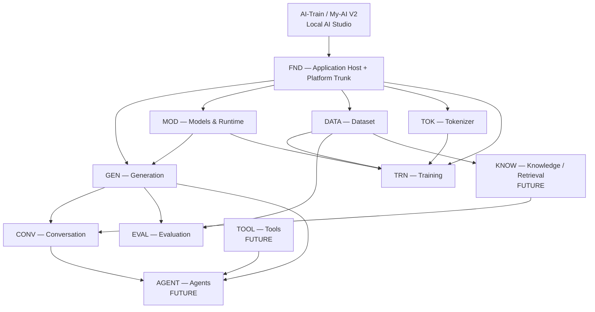
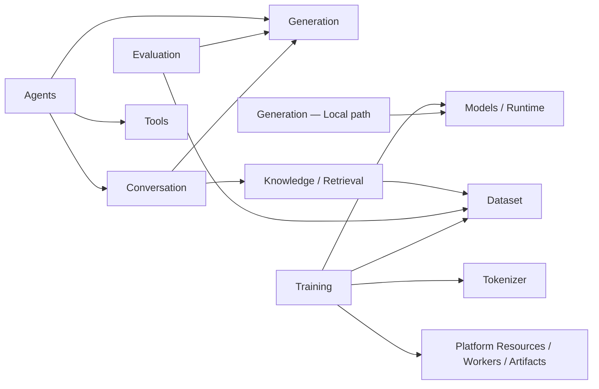
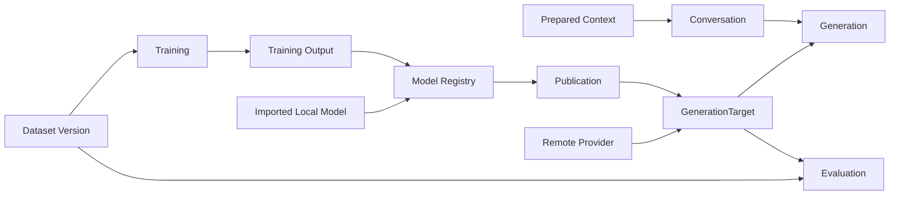
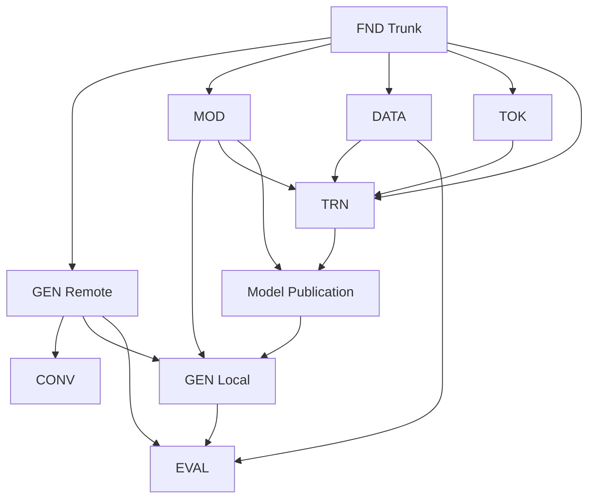

# AI-Train / My-AI V2 — Architecture Development Map & Branch Roadmaps R1

## 0. Role of This Document

This document is the **living development map** for the V2 architecture.

It does **not** replace or reopen the frozen Architecture Baseline.

The document hierarchy is:

```text
Architecture Baseline R1 — FROZEN @ Q120
        │
        │ establishes product invariants and hard boundaries
        ▼
Architecture Development Map — LIVING
        │
        ├── capability branches
        ├── branch-local architecture questions
        ├── dependency gates
        ├── vertical-slice ladders
        └── branch maturity/status
                │
                ▼
Capability Specification
        │
        ▼
Slice Implementation Plan
        │
        ▼
Implementation + Verification
```

The baseline answers:

> **What architecture is allowed?**

This map answers:

> **Where can the product grow next, what must be decided there, and what is the smallest safe end-to-end slice?**

Branch-local questions use scoped identifiers such as:

```text
GEN-Q01
MOD-Q03
DATA-Q07
TRN-Q05
EVAL-Q02
```

They are **not** new global Product Invariants and must not become `Q121+` unless implementation reveals a genuine contradiction in the frozen architecture baseline.

---

# 1. Architecture as a Development Tree

V2 should be navigated as a tree rooted in a small shared trunk.



The graph above is a **development navigation map**, not permission for arbitrary imports.

The canonical dependency direction remains governed by the Architecture Baseline and each capability's public contracts.

---

# 2. Two Kinds of Graph Must Stay Distinct

## 2.1 Capability dependency DAG

In this graph:

> `A --> B` means **A consumes a stable public contract owned by B**.



No callback, registry, event loop, or application facade may hide a reverse dependency.

## 2.2 Product value/data flow

This graph shows how product outputs can feed other capabilities without implying reverse ownership.



A flow edge does not permit a capability to reach into another capability's internals.

---

# 3. Capability Branch Catalog

| Branch | Role | Baseline status | Typical consumers |
|---|---|---:|---|
| `FND` | Host + cross-domain platform mechanics | Required trunk | All active capabilities |
| `GEN` | Canonical Generation execution semantics | Central | Conversation, Evaluation, Agents |
| `CONV` | Conversation identity/history/context policy | Active after GEN | Frontend, Agents |
| `MOD` | Acquisition, Registry, Compatibility, Publication, Runtime Residency | Core supply branch | Generation, Training, Evaluation |
| `DATA` | Dataset identity/import/version/transform/split/artifacts | Core supply branch | Training, Evaluation, Knowledge |
| `TOK` | Tokenizer artifact identity and compatibility | Core supply branch | Dataset, Models, Training |
| `TRN` | Training lifecycle and model production | First-class | Models Publication |
| `EVAL` | Benchmark/evaluation of GenerationTargets | Independent | Product, Training workflows |
| `KNOW` | Knowledge ingestion/retrieval/context artifacts | Future | Conversation |
| `TOOL` | Typed tool identity/policy/execution | Future | Agents |
| `AGENT` | Goal/loop/tool selection/termination | Future | Product workflows |

`FND` is a trunk, not a dumping-ground capability.

It grows only when a real vertical slice requires another cross-domain primitive.

---

# 4. Branch Anatomy

Every active capability branch uses the same architecture anatomy.

```text
BRANCH CHARTER
    │
    ├── responsibility
    ├── non-responsibility
    ├── public contracts
    ├── owned state
    └── dependencies
    │
    ▼
QUESTION REGISTER
    │
    ├── semantic questions
    ├── lifecycle questions
    ├── persistence questions
    ├── execution questions
    ├── failure/recovery questions
    └── boundary questions
    │
    ▼
DECISIONS / CAPABILITY SPEC
    │
    ▼
DEPENDENCY GATE
    │
    ▼
VERTICAL SLICE LADDER
    │
    ▼
SLICE PLAN
    │
    ▼
IMPLEMENT → VERIFY → FREEZE SLICE
```

Questions are answered **just in time** for a real slice.

Do not answer every imaginable future question before implementation.

---

# 5. Question Taxonomy

Each capability may draw questions from the following taxonomy.

| Prefix | Question family | Example |
|---|---|---|
| `SEM` | Semantic ownership | What is the canonical domain object? |
| `REF` | Identity/reference | Mutable ID or immutable version ref? |
| `STATE` | Lifecycle/state machine | Which transitions are legal? |
| `CFG` | Intent/config resolution | What is user intent vs resolved decision? |
| `CAP` | Capability negotiation | What is supported, verified, stale? |
| `RES` | Resources/admission | What requires a ResourceLease? |
| `EXEC` | Execution | Coordinator or worker? |
| `IPC` | Process contract | What crosses worker boundary? |
| `PERSIST` | Persistence truth | What must survive restart? |
| `ART` | Artifact semantics | Who owns bytes vs meaning? |
| `EVENT` | Realtime/significant events | Persisted event or transient stream? |
| `FAIL` | Typed failure | Which domain code represents failure? |
| `CANCEL` | Cancellation/deadline | What is cancellable and how? |
| `REC` | Recovery | Reconcile, interrupt, resume, retry? |
| `API` | Transport contract | Query/command/event shape? |
| `SEC` | Secrets/local-session/files | What may cross API boundaries? |
| `OBS` | Correlation/observability | Which IDs must correlate? |
| `MIG` | Schema/artifact migration | Who owns migration content? |
| `TEST` | Executable architecture | Which boundary/contract tests prove it? |

A branch question should produce a decision that affects architecture or slice semantics.

Implementation tuning such as pool size, batching interval, cache size, SQLite tuning, or exact timeout values belongs in implementation policy/benchmarks unless it changes architecture semantics.

---

# 6. FND — Application Host + Platform Trunk

## 6.1 Charter

`FND` owns only mechanics that are genuinely cross-domain:

```text
Application Host
Composition Root
Loopback API protection

Platform:
├── SQLite mechanics
├── ArtifactStore mechanics
├── SecretStore
├── Operations primitives
├── Domain event transport/outbox mechanics
├── Resource planning primitives
├── ResourceLease accounting
├── Worker supervision
├── Versioned typed IPC mechanics
├── Observability plumbing
├── Migration coordination
└── App-managed filesystem layout
```

It must not absorb Generation, Training, Dataset, Model, Evaluation, or Conversation policy.

## 6.2 Initial architecture questions

```text
FND-Q01 [SEM]   What is the minimum boot graph required before any capability loads?
FND-Q02 [PERSIST] How are capability-owned SQLite migrations discovered and ordered?
FND-Q03 [ART]   What is the staged → validate → atomic commit artifact protocol?
FND-Q04 [SEC]   How is loopback session/bootstrap protection established?
FND-Q05 [RES]   What is the minimal ResourceLease contract?
FND-Q06 [IPC]   What is the version envelope for ExecutionCommand/Event?
FND-Q07 [REC]   What global startup reconciliation runs before capability recovery?
FND-Q08 [OBS]   What correlation context can cross API → operation → attempt → worker?
FND-Q09 [TEST]  Which tests prove Composition Root is the only concrete wiring owner?
```

## 6.3 Trunk slice ladder

```text
FND-S0  Clean boot / READY / graceful shutdown
   │
FND-S1  SQLite + migrations + local session protection
   │
FND-S2  SecretStore + ArtifactStore minimum needed by GEN-S1
   │
FND-S3  Operation/event mechanics needed by GEN-S1/S2
   │
FND-S4  ResourceLease + worker/IPC mechanics only when local/training execution needs them
```

`FND` must evolve demand-first, never framework-first.

---

# 7. GEN — Generation Branch

## 7.1 Charter

Generation owns:

```text
GenerationRequest
→ semantic validation
→ target resolution
→ capability negotiation
→ effective parameter resolution
→ frozen semantic execution intent
→ admission/resource planning
→ GenerationOperation
→ ExecutionAttempt
→ streaming/events
→ canonical GenerationOutcome
```

Generation does not own Conversation persistence, Retrieval, Tool policy, Agents, provider secrets, model downloading, Model Registry, or Training.

## 7.2 Question register

```text
GEN-Q01 [SEM]    What is the canonical GenerationRequest/Content boundary?
GEN-Q02 [REF]    What exactly is referenced by target_id at submission time?
GEN-Q03 [CAP]    How are declared/discovered/runtime-verified capabilities represented?
GEN-Q04 [CAP]    When does capability evidence become stale and require targeted refresh?
GEN-Q05 [CFG]    How are request/default/preset values resolved into effective parameters?
GEN-Q06 [SEM]    What is frozen before queue admission?
GEN-Q07 [STATE]  What are GenerationOperation states?
GEN-Q08 [STATE]  What are ExecutionAttempt states?
GEN-Q09 [FAIL]   Which failures terminate an Attempt vs the whole Operation?
GEN-Q10 [EXEC]   What is the stable Remote Provider Driver contract?
GEN-Q11 [EVENT]  What are canonical GenerationEvents?
GEN-Q12 [EVENT]  Which stream events are transient vs durably significant?
GEN-Q13 [CANCEL] How do cancellation, operation deadline and provider timeout differ?
GEN-Q14 [FAIL]   How is fallback explicitly accepted, frozen and audited?
GEN-Q15 [PERSIST] What submitted intent/resolved snapshot/outcome must be durable?
GEN-Q16 [REC]    How are stale RUNNING operations classified after restart?
GEN-Q17 [API]    What is the minimal command/query/SSE API surface?
GEN-Q18 [SEC]    How do ProviderProfile, SecretRef and SecretStore interact?
GEN-Q19 [OBS]    What correlation IDs are visible on operation/attempt/driver events?
GEN-Q20 [TEST]   Which contract/state/recovery tests define Generation's public semantics?
GEN-Q21 [RES]    What changes when execution target becomes local and scarce resources matter?
GEN-Q22 [EXEC]   What local-runtime contract does Generation consume without owning residency?
```

## 7.3 Vertical slice ladder

```text
GEN-S1  Remote Generation E2E
        ProviderProfile + SecretRef + GenerationTarget
        → submit
        → Operation
        → Attempt
        → remote driver
        → canonical outcome
        → frontend result

   │
   ▼
GEN-S2  Streaming + bounded backpressure + cancellation
        → SSE/domain stream
        → partial output semantics
        → terminal outcome

   │
   ▼
GEN-S3  Capability negotiation + provenance/freshness
        → unsupported typed failure
        → accepted fallback
        → immutable fallback decision

   │
   ▼
GEN-S4  Durable history + restart recovery
        → submitted intent
        → frozen execution snapshot
        → attempts
        → reconciliation/interruption

   │
   ▼
GEN-S5  Local Generation
        → published local GenerationTarget
        → Runtime/Residency
        → ResourceLease
        → typed worker/runtime execution

   │
   ▼
GEN-S6  Presets + richer normalized content
        → reusable semantic defaults
        → no runtime-plan leakage
```

## 7.4 GEN dependency gates

```text
GEN-S1 requires: FND-S0..S3 minimum
GEN-S2 requires: GEN-S1
GEN-S3 requires: GEN-S1
GEN-S4 requires: GEN-S1 + durable FND mechanics
GEN-S5 requires: MOD local publication/runtime path + ResourceLease/worker mechanics
GEN-S6 requires: stable GEN request/config semantics
```

---

# 8. CONV — Conversation Branch

## 8.1 Charter

Conversation owns identity, messages, metadata, context policy, summaries, default target reference and construction of normalized `GenerationRequest`.

Conversation is above Generation and must not become the Generation engine.

## 8.2 Question register

```text
CONV-Q01 [SEM]     What is persisted ConversationMessage vs GenerationContent?
CONV-Q02 [REF]     What does a conversation store as default target reference?
CONV-Q03 [STATE]   What conversation/message mutations require revisions?
CONV-Q04 [CFG]     Which defaults belong to project/conversation/request?
CONV-Q05 [SEM]     Who assembles normalized context and in what order?
CONV-Q06 [PERSIST] What execution metadata is referenced from a generated assistant message?
CONV-Q07 [REC]     What happens when Generation completes but message persistence fails?
CONV-Q08 [API]     Which conversation commands are separate from Generation commands?
CONV-Q09 [TEST]    Which tests prove Conversation can call Generation without owning it?
```

## 8.3 Vertical slice ladder

```text
CONV-S1  Persist conversation + user message
         → construct GenerationRequest
         → call GEN
         → persist assistant result reference/content

CONV-S2  Multi-turn context policy
         → deterministic normalized request construction

CONV-S3  Conversation defaults / target selection / preset references

CONV-S4  Summaries or context compaction when a real product need exists
```

Dependency:

```text
CONV --> GEN
```

Never:

```text
GEN --> CONV
```

---

# 9. MOD — Models & Runtime Branch

## 9.1 Charter

```text
Models
├── Acquisition
├── Registry
├── Integrity / Trust
├── Compatibility
├── Publication
└── Runtime / Residency
```

Artifact format, registered model identity, published GenerationTarget and loaded runtime residency are distinct concepts.

## 9.2 Question register

```text
MOD-Q01 [SEM]     What is canonical LocalModel identity?
MOD-Q02 [ART]     What is ModelArtifactFormat and which metadata belongs to it?
MOD-Q03 [REF]     Which refs are immutable enough for reproducible execution?
MOD-Q04 [SEM]     Where does acquisition end and registration begin?
MOD-Q05 [SEC]     What trust/integrity classifications exist before registration?
MOD-Q06 [CAP]     How is model/runtime compatibility represented and invalidated?
MOD-Q07 [SEM]     What explicit action publishes a Model as a GenerationTarget?
MOD-Q08 [STATE]   What are ACTIVE/DISABLED/ARCHIVED semantics for live resources?
MOD-Q09 [EXEC]    What is the LocalRuntimeDriver contract?
MOD-Q10 [RES]     What is a model residency/load lease?
MOD-Q11 [RES]     How are reuse/eviction/unload decisions separated from model identity?
MOD-Q12 [CAP]     What runtime-health evidence is cached and when is it stale?
MOD-Q13 [IPC]     What runtime execution data may cross process boundaries?
MOD-Q14 [REC]     What runtime state disappears on crash and what is reconstructed?
MOD-Q15 [TEST]    Which tests prove format != registry != publication != residency?
```

## 9.3 Vertical slice ladder

```text
MOD-S1  Import local model artifact
        → inspect/hash
        → compatibility/trust classification
        → register canonical LocalModel

MOD-S2  Runtime compatibility + lazy health verification

MOD-S3  Load / reuse / lease / unload local residency

MOD-S4  Explicit publication
        LocalModel → GenerationTarget

MOD-S5  Integrate with GEN-S5 local Generation

MOD-S6  Download/acquisition path after import path semantics are stable
```

---

# 10. DATA — Dataset Branch

## 10.1 Charter

Dataset owns source/import, inspection, transformation, immutable versioning, splitting and dataset artifacts.

It is independent from Training.

## 10.2 Question register

```text
DATA-Q01 [SEM]     What is Dataset identity vs DatasetVersion identity?
DATA-Q02 [REF]     What makes a DatasetVersion immutable/reproducible?
DATA-Q03 [ART]     Which bytes belong to ArtifactStore and which metadata belongs to Dataset?
DATA-Q04 [SEM]     How is source/import provenance represented?
DATA-Q05 [SEM]     How is transformation lineage represented?
DATA-Q06 [SEM]     What are split semantics and reproducibility requirements?
DATA-Q07 [PERSIST] What inspection metadata is canonical vs derived cache?
DATA-Q08 [STATE]   What can be edited without producing a new version?
DATA-Q09 [FAIL]    How are malformed/partial imports represented?
DATA-Q10 [API]     What inspection/read projection does frontend consume?
DATA-Q11 [TEST]    Which tests guarantee versions consumed by Training never drift?
```

## 10.3 Vertical slice ladder

```text
DATA-S1  Import → immutable DatasetVersion → inspect

DATA-S2  Transform → new DatasetVersion with lineage

DATA-S3  Deterministic split artifacts / refs

DATA-S4  Consume immutable version from Training

DATA-S5  Evaluation / Knowledge consumers
```

---

# 11. TOK — Tokenizer Branch

## 11.1 Charter

Tokenizer is an identifiable artifact/capability, never a hidden process-global singleton.

## 11.2 Question register

```text
TOK-Q01 [SEM]   What defines TokenizerArtifact identity/version?
TOK-Q02 [ART]   Which vocabulary/model bytes belong to the artifact?
TOK-Q03 [CAP]   What compatibility metadata is needed by Models/Dataset/Training?
TOK-Q04 [EXEC]  Where do encode/decode mechanics execute?
TOK-Q05 [REF]   Which immutable ref is frozen into TrainingSpec/ResolvedPlan?
TOK-Q06 [TEST]  Which tests prevent implicit global tokenizer state?
```

## 11.3 Vertical slice ladder

```text
TOK-S1  Import/register TokenizerArtifact + encode/decode contract

TOK-S2  Dataset/Model compatibility checks

TOK-S3  Immutable TokenizerArtifactRef consumed by Training
```

---

# 12. TRN — Training Branch

## 12.1 Charter

Training owns:

```text
TrainingSpec
TrainingRun
ResolvedPlan
resource admission
ExecutionAttempt
worker execution semantics
progress
checkpoint semantics
recovery/resume
training outputs
optional publication request
```

Training output does not automatically become a GenerationTarget.

## 12.2 Question register

```text
TRN-Q01 [SEM]     What belongs to TrainingSpec?
TRN-Q02 [REF]     Which DatasetVersion/ModelArchitecture/Tokenizer refs are frozen?
TRN-Q03 [CFG]     What is submitted training intent vs ResolvedPlan?
TRN-Q04 [RES]     Which SystemCapabilities facts affect feasibility?
TRN-Q05 [RES]     How does admission produce a ResourceLease?
TRN-Q06 [STATE]   What is the TrainingRun state machine?
TRN-Q07 [STATE]   What is a Training ExecutionAttempt?
TRN-Q08 [EXEC]    Which mechanics execute in coordinator vs heavy worker?
TRN-Q09 [IPC]     What is the typed Training ExecutionCommand/Event contract?
TRN-Q10 [EVENT]   Which progress is transient vs significant/durable?
TRN-Q11 [CANCEL]  What does stop/cancel mean at each execution stage?
TRN-Q12 [ART]     How are staged checkpoint/model bytes validated and committed?
TRN-Q13 [SEM]     What makes a checkpoint resumable but not publishable?
TRN-Q14 [REC]     What exactly is required for safe resume after crash?
TRN-Q15 [PERSIST] What terminal Training snapshot is immutable?
TRN-Q16 [SEM]     How does output become a registered ModelArtifact?
TRN-Q17 [SEM]     Who performs optional Publication to GenerationTarget?
TRN-Q18 [RES]     How does Training coexist with higher-priority interactive Generation?
TRN-Q19 [API]     What command/query/event surface does Training expose?
TRN-Q20 [TEST]    Which tests prove worker never owns business DB/state?
```

## 12.3 Vertical slice ladder

```text
TRN-S1  Minimal real Training E2E
        immutable DatasetVersionRef
        + ModelArchitectureRef
        + TokenizerArtifactRef
        → TrainingSpec
        → ResolvedPlan
        → ResourceLease
        → TrainingRun/Attempt
        → worker
        → staged output
        → durable training artifact

   │
   ▼
TRN-S2  Progress + bounded events + cancellation

   │
   ▼
TRN-S3  Checkpoint creation + explicit resume

   │
   ▼
TRN-S4  Startup reconciliation + interrupted/recoverable semantics

   │
   ▼
TRN-S5  Training output → Model Registry

   │
   ▼
TRN-S6  Explicit Publication → GenerationTarget
        → reusable by GEN without GEN depending on TRN

   │
   ▼
TRN-S7  Resource-contention policy with interactive local Generation
```

## 12.4 TRN dependency gates

```text
TRN-S1 requires:
    DATA-S1/S3 semantics needed by the selected training path
    TOK-S1/S3
    required MOD architecture/artifact contract
    FND resource + worker + artifact mechanics

TRN-S5 requires:
    MOD registry contract

TRN-S6 requires:
    MOD publication contract
    GEN GenerationTarget contract
```

The dependency is through stable contracts.

Training must never import Generation internals.

---

# 13. EVAL — Evaluation Branch

## 13.1 Charter

Evaluation benchmarks one or more GenerationTargets against an EvaluationSet/Dataset and owns EvaluationSpec, execution semantics, metrics and EvaluationResult.

Evaluation is independent from Training.

## 13.2 Question register

```text
EVAL-Q01 [SEM]     What is EvaluationSpec?
EVAL-Q02 [REF]     Which target/config/dataset snapshots make a result reproducible?
EVAL-Q03 [EXEC]    Does Evaluation call Generation as a capability or bypass it? (Must preserve GEN semantics.)
EVAL-Q04 [RES]     How are evaluation workloads admitted relative to interactive Generation?
EVAL-Q05 [PERSIST] Which metrics/results/artifacts are durable?
EVAL-Q06 [EVENT]   Which progress events matter?
EVAL-Q07 [REC]     Can an interrupted evaluation resume or only retry?
EVAL-Q08 [API]     What read projection supports comparison?
EVAL-Q09 [TEST]    Which tests prove Evaluation does not become Training-owned?
```

## 13.3 Vertical slice ladder

```text
EVAL-S1  One EvaluationSet × one GenerationTarget → durable EvaluationResult

EVAL-S2  Multiple targets with frozen comparable execution semantics

EVAL-S3  Comparison/report projection

EVAL-S4  Optional Training workflow consumes Evaluation result
         without Evaluation depending on Training
```

---

# 14. Future Branches

These branches remain architectural placeholders in this **map only**.

No source package or speculative interface is created until a real vertical slice is approved.

## KNOW — Knowledge / Retrieval

Likely progression:

```text
ingestion
→ immutable knowledge artifact
→ retrieval
→ prepared context artifact
→ Conversation
→ Generation
```

## TOOL — Tools

Likely progression:

```text
tool identity
→ schema
→ permission/policy
→ execution contract
→ typed result
```

## AGENT — Agents

Likely progression:

```text
goal
→ state
→ Conversation / Generation call
→ Tool selection
→ iteration
→ termination
```

Agent is not Generation and Tool execution is not a model runtime escape hatch.

---

# 15. Cross-Branch Convergence Map

The important joins are explicit.



The high-risk convergence is:

```text
Training Output
    ↓
Model Registry
    ↓
Publication
    ↓
GenerationTarget
    ↓
Generation
```

This must remain a one-way product flow.

Generation never depends on Training.

---

# 16. Branch Selection Protocol

When development chooses one branch, use this protocol.

## Step A — Select one target slice

Example:

```text
Selected branch: TRN
Selected slice: TRN-S1
```

Do not select "finish Training".

Select the smallest end-to-end behavior.

## Step B — Load architecture context

Required context:

```text
1. Frozen Architecture Baseline
2. This Development Map
3. Selected branch charter/question register
4. Direct dependency branch contracts
5. Relevant archaeology inventory from old src/
```

## Step C — Answer only blocking questions

Classify branch questions as:

```text
LOCKED       already answered by baseline/spec
OPEN-BLOCKER must be answered before selected slice
OPEN-LATER   real question, not needed yet
DEFERRED     future capability/optimization
INVALID      conflicts with baseline; do not pursue
```

## Step D — Produce/update Capability Spec

A Capability Spec contains:

```text
Ownership
Public contracts
Domain types
State machine
Persistence truth
Artifact semantics
Failure taxonomy
Cancellation/recovery semantics
Dependencies
API/event boundary
Executable architecture tests
Resolved branch questions
Explicit non-goals
```

## Step E — Freeze the slice boundary

A slice must specify:

```text
Input
Owned decision path
Dependency contracts
Executable path
Persisted truth
Terminal result/failure
Cancellation/recovery if relevant
API surface
Tests
```

## Step F — Implement one slice

Do not simultaneously redesign adjacent branches unless a missing dependency contract blocks the slice.

If blocked, create the smallest dependency slice required.

## Step G — Verification gate

A slice is not DONE merely because unit tests are green.

Verify:

```text
architecture boundaries
contract tests
state machine
typed failures
persistence/recovery
worker boundary where relevant
API transport contract
frontend integration where in slice scope
restart/cancellation paths where relevant
```

## Step H — Feed results back to docs

After implementation:

```text
question answers → LOCKED
Capability Spec → revision bump
slice → DONE
new contradiction → architecture review
implementation tuning → policy/benchmark notes
```

Do not silently mutate the frozen baseline.

---

# 17. Slice Definition of Done

Every production vertical slice must be end-to-end and demonstrable.

```text
[ ] User/product input exists
[ ] Nearest stable capability entry point exists
[ ] Semantic validation owner is explicit
[ ] Mutable references are resolved appropriately
[ ] Submitted intent is separated from runtime decision
[ ] State transitions are explicit
[ ] Typed failures exist
[ ] Persistence truth is defined
[ ] Significant event semantics are defined
[ ] Long I/O does not hold DB transactions
[ ] Cancellation/deadline semantics are defined when relevant
[ ] Recovery semantics are defined when relevant
[ ] Worker boundary is typed when relevant
[ ] ResourceLease is used when scarce resources are claimed
[ ] Artifact commit is staged/validated/atomic when relevant
[ ] API contract exposes business semantics, not internals
[ ] Architecture tests enforce the dependency boundary
[ ] End-to-end test proves the slice
[ ] No speculative framework/package was introduced
```

---

# 18. Recommended Global Development Roadmap

The frozen baseline remains Generation-first.

The branch map makes the dependencies visible:

```text
R0 — FOUNDATION MINIMUM
     FND-S0 → FND-S3
        │
        ▼
R1 — REMOTE GENERATION
     GEN-S1 → GEN-S4
        │
        ├──────────────► CONV-S1 → CONV-S3
        │
        ▼
R2 — LOCAL MODEL SUPPLY
     MOD-S1 → MOD-S4
        │
        ▼
     GEN-S5
        │
        ├──────────────► EVAL-S1 (when DATA is ready)
        │
        ▼
R3 — DATA / TOKENIZER SUPPLY
     DATA-S1 → DATA-S3
     TOK-S1  → TOK-S3
        │
        ▼
R4 — TRAINING
     TRN-S1 → TRN-S6
        │
        └── output → MOD Registry → Publication → GEN Target
        │
        ▼
R5 — RESOURCE CONTENTION / POLISH
     TRN-S7 + local GEN resource policy
        │
        ▼
R6 — EVALUATION
     EVAL-S1 → EVAL-S4
        │
        ▼
R7+ — REAL FUTURE VERTICALS
      KNOW / TOOL / AGENT only when product demand exists
```

This is a default ordering, not a requirement to finish an entire branch before touching another.

A branch may advance when:

```text
its next slice has product value
+
all hard dependency gates are satisfied
+
no reverse dependency is introduced
```

---

# 19. Parallel Development Rules

Parallel work is safe only for independent slices.

Example:

```text
GEN-S3 capability negotiation
          and
DATA-S1 dataset import/versioning
```

can proceed in parallel if they share only stable platform contracts.

Unsafe parallel work:

```text
MOD publication contract
          and
GEN-S5 local generation
```

when both teams are changing the same GenerationTarget contract.

Use one contract owner and freeze the boundary first.

---

# 20. Architecture Question Flow

Questions should narrow toward an executable slice.

```mermaid
flowchart LR
    A["Product capability"] --> B["Branch charter"]
    B --> C["Open architecture questions"]
    C --> D["Decisions"]
    D --> E["Capability public contracts"]
    E --> F["Dependency gate"]
    F --> G["Vertical slice"]
    G --> H["Implementation"]
    H --> I["Tests / recovery / E2E"]
    I --> J["Freeze slice semantics"]
    J --> K["Next branch question"]
```



A question that cannot affect a real capability decision or future slice should normally not be asked yet.

---

# 21. Documentation Layout

Recommended repository structure:

```text
docs/
└── v2/
    ├── architecture/
    │   ├── baseline/
    │   │   └── v2-architecture-baseline-r1.md
    │   │
    │   ├── development-map/
    │   │   └── v2-architecture-development-map-r1.md
    │   │
    │   └── decisions/
    │       └── architecture-contradictions.md
    │
    ├── archaeology/
    │   ├── functional-inventory.md
    │   └── classifications.md
    │
    ├── capabilities/
    │   ├── generation/
    │   │   ├── branch.md
    │   │   ├── questions.md
    │   │   └── capability-spec-r1.md
    │   ├── conversation/
    │   ├── models/
    │   ├── dataset/
    │   ├── tokenizer/
    │   ├── training/
    │   └── evaluation/
    │
    └── slices/
        ├── GEN-S1-remote-generation-e2e.md
        ├── GEN-S2-streaming-cancellation.md
        ├── MOD-S1-local-model-import.md
        ├── DATA-S1-import-version-inspect.md
        └── TRN-S1-minimal-training-e2e.md
```

Do not create empty future capability source packages merely because a docs branch exists.

Docs can map the future; source is created only with a real vertical slice.

---

# 22. Branch File Template

Each `capabilities/<branch>/branch.md` should use this compact structure:

```text
# <ID> — <Capability>

## Charter
Owns:
Does not own:

## Public Surface
Inputs:
Outputs:
Events:
Typed failures:

## Dependencies
Consumes:
Consumed by:
Forbidden dependencies:

## Owned Truth
DB:
Artifacts:
Ephemeral runtime:

## State Machines
...

## Question Register
<ID>-Q01 ...
<ID>-Q02 ...

## Slice Ladder
<ID>-S1 ...
<ID>-S2 ...

## Dependency Gates
...

## Current Status
Next slice:
Blockers:
Locked questions:
Open blockers:
Open later:
```

This is the main "navigation page" for a branch.

---

# 23. Slice Plan Template

Each selected slice gets its own implementation plan.

```text
# <BRANCH>-S<n> — <Name>

## Product Outcome
What becomes possible after this slice?

## Scope
IN:
OUT:

## Architecture Decisions Used
Baseline invariants:
Branch decisions:

## Dependency Contracts
...

## End-to-End Flow
Input
→ capability
→ dependencies
→ execution
→ persistence
→ outcome
→ API/frontend

## State / Failure / Recovery
...

## Persistence / Artifacts
...

## API / Event Contract
...

## Tests
Unit:
Contract:
Architecture:
Recovery:
E2E:

## Archaeology Reuse
MUST KEEP:
KEEP + REDESIGN:
DELETE:

## Completion Gate
...
```

---

# 24. Change Rules

## Baseline changes

Change the frozen baseline only when implementation proves a genuine architecture-level contradiction.

A baseline revision requires explicit architectural review.

## Development Map changes

The map may evolve when:

```text
a real capability is added
a dependency gate changes
a slice is split/merged
a branch matures
a future branch becomes real
```

## Capability Spec changes

Revision when public semantics, state, persistence truth, or boundary contracts change.

## Slice Plan changes

Freely evolve before implementation freeze.

After a slice is DONE, preserve its accepted semantic decisions and create a new slice/revision for behavior changes.

---

# 25. Recommended Status Model

For branches:

```text
MAPPED
QUESTIONS_OPEN
SPEC_READY
ACTIVE
STABLE
DEFERRED
```

For slices:

```text
PROPOSED
BLOCKED
READY
IMPLEMENTING
VERIFYING
DONE
```

For questions:

```text
OPEN-BLOCKER
OPEN-LATER
LOCKED
DEFERRED
INVALID
```

This allows the architecture docs to function as an actual navigation system rather than static prose.

---

# 26. Current North-Star View

The V2 architecture should be mentally read as:

```text
                         AI STUDIO
                            │
                      PLATFORM TRUNK
                            │
          ┌─────────────────┼───────────────────┐
          │                 │                   │
          ▼                 ▼                   ▼
     GENERATION          MODELS              DATASET
          │                 │                   │
          │                 │                   ├──── TOKENIZER
          │                 │                   │
          ▼                 └────────┐          ▼
   CONVERSATION                      └────── TRAINING
          │                                  │
          │                                  ▼
          │                            MODEL ARTIFACT
          │                                  │
          │                              PUBLICATION
          │                                  │
          └───────────────┐                  ▼
                          └────────── GENERATION TARGET
                                      │
                                      ▼
                                  GENERATION

           GENERATION + DATASET ─────────► EVALUATION

           FUTURE:
           DATASET ─► KNOWLEDGE ─► CONVERSATION
           TOOLS + CONVERSATION + GENERATION ─► AGENTS
```

The central product loop remains:

```text
Acquire / Import / Train
        │
        ▼
Model Registry
        │
        ▼
Publication
        │
        ▼
GenerationTarget
        │
        ▼
Generation
```

Training enriches the supply of targets.

Training never becomes a prerequisite for Generation.

---

# 27. Architecture Navigation Example

Suppose the next decision is:

> "Develop Training."

Do not immediately design the entire Training Studio.

Navigate:

```text
TRN branch
   │
   ▼
Choose TRN-S1
   │
   ▼
Check dependencies
   ├── DATA immutable version
   ├── TokenizerArtifactRef
   ├── ModelArchitectureRef
   ├── ResourcePlanner/Lease
   ├── Worker IPC
   └── Artifact staged commit
   │
   ▼
Answer only TRN-Q blockers for TRN-S1
   │
   ▼
Freeze Training Capability Spec subset
   │
   ▼
Write TRN-S1 implementation plan
   │
   ▼
Implement end-to-end
   │
   ▼
Verify architecture + recovery + E2E
   │
   ▼
TRN-S1 DONE
   │
   ▼
Choose TRN-S2 / another branch
```

If the next decision is:

> "Develop Generation."

Navigate the same way through `GEN-S1`, not through Training internals.

This makes each development choice bounded, reviewable and reversible without sacrificing the global architecture.

---

# 28. Final Rule

The architecture map exists to answer three questions at all times:

```text
1. WHERE are we in the product capability graph?
2. WHAT architecture questions must be decided before the next real behavior?
3. WHAT is the smallest vertical slice that proves those decisions end to end?
```

If a document, class, service, abstraction, or implementation task cannot be placed on that map with a clear owner and slice, it is a candidate for redesign, deferral, or deletion.
